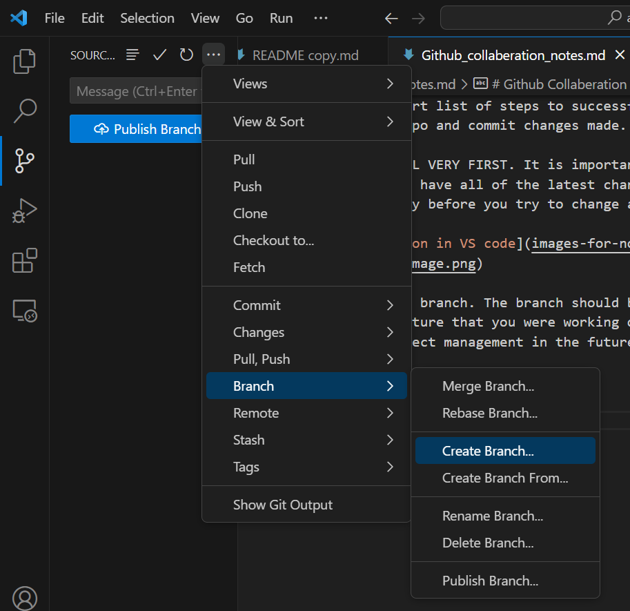

# Github Collaberation

## How to branch.
This is a short list of steps to successfully branch the repo and commit changes made.

1. ALWAYS PULL VERY FIRST. It is important to make sure that you have all of the latest changes to the repository before you try to change anthing.

2. Create the branch.
- The branch should be named after the feature that you were working on. This can help project management in the future.

- After you have named your branch and created it, click the button that says, "Publish Branch".

3. Stage changes and commit changes.
- Stage changes by clicking the + symbol by the files that you would like to push to the repository.

- Once you have made your changes to the repository, you can commit your changes. Make the message for you commit descriptive of the work done.

4. sync changes to Push the commited changes to the repo.

5. Inform the team that there is a new branch to be reviewed for merge.

## How to merge a branch

1. Compare and pull branch to main.

2. Add notes on your changes you have made and say anything that teammates may need to understand. Click Creat pull request.

3. This section teammates can review your changes before we merge with main. With a teammates approval, you can click merge.
- If you are the teammate reviewing, you can add a comments on the work here.

